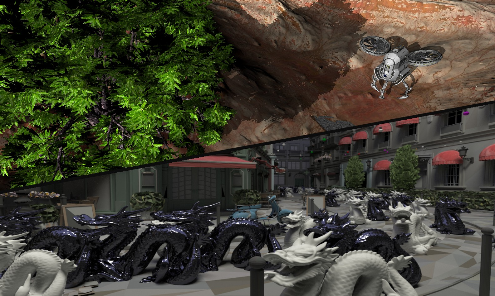
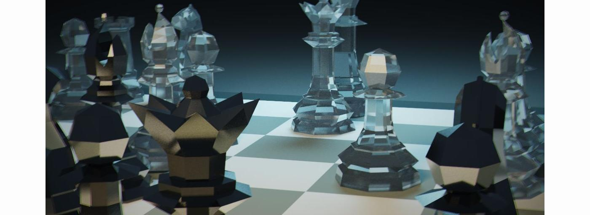
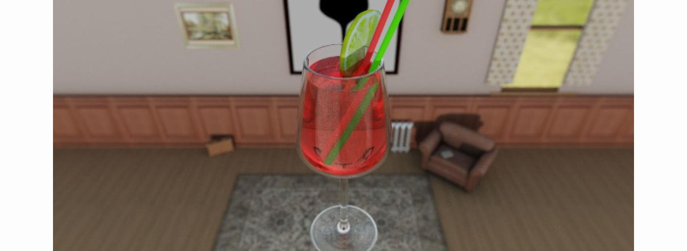

# TinyBVH
Single-header BVH construction and traversal library written as "Sane C++" (or "C with classes"). Some C++11 is used, e.g. for threading. The library has no dependencies. 

# TinyOCL
Single-header OpenCL library, which helps you select and initialize a device. It also loads, compiles and runs kernels, with several convenient features:
* Include-file expansion for AMD devices
* Multi-argument passing
* Host/device buffer management
* Vendor and architecture detection and propagation to #defines in OpenCL code
* ..And many other things.



To use tinyocl, just include ````tiny_ocl.h````; this will automatically cause linking with ````OpenCL.lib```` in the 'external' folder, which in turn passes on work to vendor-specific driver code. But all that is not your problem!

Note that the ````tiny_bvh.h```` library will work without ````tiny_ocl.h```` and remains dependency-free. The new ````tiny_ocl.h```` is only needed in projects that wish to trace rays _on the GPU_ using BVHs created by ````tiny_bvh.h````. 
  
# BVH?
A Bounding Volume Hierarchy is a data structure used to quickly find intersections in a virtual scene; most commonly between a ray and a group of triangles. You can read more about this in a series of articles on the subject: https://jacco.ompf2.com/2022/04/13/how-to-build-a-bvh-part-1-basics .

Right now TinyBVH comes with the following builders:
* ````BVH::Build```` : Efficient plain-C/C+ binned SAH BVH builder which should run on any platform.
* ````BVH::BuildAVX```` : A highly optimized version of BVH::Build for Intel CPUs.
* ````BVH::BuildHQ```` : A 'spatial splits' BVH builder, for highest BVH quality.

A constructed BVH can be used to quickly intersect a ray with the geometry, using ````BVH::Intersect```` or ````BVH::IsOccluded````, for shadow rays. The double-precision BVH is traversed using ````BVH::IntersectEx````.

Apart from the default BVH layout (simply named ````BVH````), several other layouts are available, which all serve one or more specific purposes. You can create a BVH in the desired layout by instantiating the appropriate class, or by converting from ````BVH```` using the ````::ConvertFrom```` methods. The available layouts are:
* ````BVH```` : A compact format that stores the AABB for a node, along with child pointers and leaf information in a cross-platform-friendly way. The 32-byte size allows for cache-line alignment.
* ````BVH_SoA```` : This format stores bounding box information in a SIMD-friendly format, making the BVH faster to traverse.
* ````BVH_Double```` : Double-precision version of ````BVH````.
* ````BVH_GPU```` : This format uses 64 bytes per node and stores the AABBs of the two child nodes. This is the format presented in the [2009 Aila & Laine paper](https://research.nvidia.com/sites/default/files/pubs/2009-08_Understanding-the-Efficiency/aila2009hpg_paper.pdf). It can be traversed with a simple GPU kernel.
* ````MBVH<M>```` : In this (templated) format, each node stores M child pointers, reducing the depth of the tree. This improves performance for divergent rays. Based on the [2008 paper](https://graphics.stanford.edu/~boulos/papers/multi_rt08.pdf) by Ingo Wald et al.
* ````BVH4_GPU```` : A compact version of the ````BVH4```` format, which will be faster for GPU ray tracing.
* ````BVH4_CPU```` : SSE-optimzied wide BVH traversal. The fastest option for CPUs that do not support AVX.
* ````BVH8_CPU```` : AVX2-optimized wide BVH traversal. This is the fastest option on CPU.
* ````BVH8_CWBVH```` : An advanced 80-byte representation of the 8-wide BVH, for state-of-the-art GPU rendering, based on the [2017 paper](https://research.nvidia.com/publication/2017-07_efficient-incoherent-ray-traversal-gpus-through-compressed-wide-bvhs) by Ylitie et al. and [code by AlanWBFT](https://github.com/AlanIWBFT/CWBVH).

A BVH in any format can be _rebuilt_ at any time by calling the ````Build```` method on the changed triangle data. A BVH may also be _refitted_, in case the triangles moved, using ````BVH::Refit````. Refitting is substantially faster than rebuilding and works well if the animation is subtle. Refitting does not work if polygon counts change.

Most layouts may be serialized and de-serialized via ````::Save```` and ````::Load````.

A more complete overview of TinyBVH functionality can be found in the [Basic Use Manual](https://jacco.ompf2.com/2025/01/24/tinybvh-manual-basic-use) and the [Advanced Topics Manual](https://jacco.ompf2.com/2025/01/25/tinybvh-manual-advanced).

# How To Use
The library ````tiny_bvh.h```` is designed to be easy to use. Please have a look at tiny_bvh_minimal.cpp for an example. A Visual Studio 'solution' (.sln/.vcxproj) is included, as well as a CMake file. That being said: The examples consists of only a single source file, which can be compiled with clang or g++, e.g.:

````g++ tiny_bvh_minimal.cpp````

The cross-platform fenster-based single-source **bitmap renderer** can be compiled with

````g++ -mwindows -O3 tiny_bvh_fenster.cpp -o tiny_bvh_fenster```` (on windows)

````c++ --std=c++17 -framework Cocoa -O3 tiny_bvh_fenster.cpp -o tiny_bvh_fenster```` (on macOS)

The multi-threaded **path tracing** demo can be compiled with

````g++ -mwindows -O3 tiny_bvh_pt.cpp -o tiny_bvh_pt```` (on windows)

````c++ --std=c++17 -framework Cocoa -O3 tiny_bvh_pt.cpp -o tiny_bvh_pt```` (on macOS)

The **performance measurement tool** can be compiled with:

````g++ -mavx2 -mfma -Ofast tiny_bvh_speedtest.cpp -o tiny_bvh_speedtest```` (on windows)

````c++ --std=c++17 -framework OpenCL -Ofast tiny_bvh_speedtest.cpp -o tiny_bvh_speedtest```` (on macOS)

Many additional demos are provided, demonstrating features of the library in small source files.

# Version 1.6.3

Basic use:

````
BVH bvh;
bvh.Build( (bvhvec4*)myTriData, triangleCount ); // or: BuildHQ( .. )
bvh.Intersect( ray );
````

To build a BVH for indexed vertices, use the new indexed interface:

````
BVH bvh;
bvh.Build( (bvhvec4*)vertices, (uint32_t*)indices, triangleCount );
````

If you wish to use a specific builder (such as the spatial splits builder) or if you need to do custom operations on the BVH, such as post-build optimizing, you can still do the conversions manually. Example:

````
BVH bvh;
bvh.BuildHQ( verts, indices, triCount );
BVH_Verbose tmp;
tmp.ConvertFrom( bvh );
tmp.Optimize( 100 );
bvh.ConvertFrom( tmp );
printf( "Optimized BVH SAH cost: %f\n", bvh.SAHCost() );
````

Note that in this case, data ownership and lifetime must be managed carefully. Specifically, layouts converted from other layouts use data from the original, so both must be kept alive.

This version of the library includes the following functionality:
* Reference 'full-sweep' SAH BVH builder
* Fast cross-platform binned SAH BVH builder
* Fast binned SAH BVH builder using AVX intrinsics
* Fast binned SAH BVH builder using NEON intrinsices, by [wuyakuma](https://github.com/wuyakuma)
* Spatial Splits ([SBVH](https://www.nvidia.in/docs/IO/77714/sbvh.pdf), Stich et al., 2009) builder, including "unsplitting"
* Wide BVHs (any width) using collapsing
* TLAS builder with instancing and fast TLAS/BLAS traversal, even for 'mixed trees'
* TLAS masking (similar to [OptiX](https://raytracing-docs.nvidia.com/optix7/guide/optix_guide.230712.A4.pdf)), by [Romain Augier](https://github.com/romainaugier).
* Support for custom geometry and mixed scenes
* Double-precision binned SAH BVH builder
* Customizable SAH parameters for all builders
* "End-Point Overlap" BVH cost metric (["On Quality Metrics of Bounding Volume Hierarchies"](https://users.aalto.fi/~ailat1/publications/aila2013hpg_paper.pdf), Aila et al., 2013)
* GPU-friendly layouts, including 'Compressed Wide BVH' (CWBVH) for state-of-the-art GPU performance
* Support for custom primitives via callbacks, also in double-precision BVHs
* BVH (de)serialization for most layouts

Besides basic examples demonstrating usage of the library, these more advanced examples are provided:
* Example OpenCL code for GPU TLAS/BLAS traversal (dragon invasion demo, tiny_bvh_gpu2.cpp)
* Example OpenGL / compute shader code for GPU BLAS traversal (tiny_bvh_gl_compute)
* Example TLAS/BLAS application using OpenGL interop (windows only)

Advanced / exotic features of the library include:
* BVH optimizer: reduces SAH cost and improves ray tracing performance ([Bittner et al., 2013](https://dspace.cvut.cz/bitstream/handle/10467/15603/2013-Fast-Insertion-Based-Optimization-of-Bounding-Volume-Hierarchies.pdf))
* Opacity Micro Map support (as proposed [by Gruen et al.](https://dl.acm.org/doi/10.1145/3406180) in 2020)
* Sphere/BVH collision detection via BVH::IntersectSphere(..)
* Fast AVX2 ray tracing: Implements the 2017 paper by [Fuetterling et al.](https://web.cs.ucdavis.edu/~hamann/FuetterlingLojewskiPfreundtHamannEbertHPG2017PaperFinal06222017.pdf)
* Fast SSE4.2 ray tracing: A modified version of the AVX2 implementation using just SSE4.2 achieves 80% of AVX2 performance.
* Fast triangle intersection: Implements the 2016 paper by [Baldwin & Weber](https://jcgt.org/published/0005/03/03/paper.pdf)
* 'Watertight' ray/triangle intersection, based on the [paper](https://jcgt.org/published/0002/01/05/paper.pdf) by Woop et al.
* OpenCL traversal example code: Aila & Laine, 4-way quantized, CWBVH
* OpenCL support for MacOS, by [wuyakuma](https://github.com/wuyakuma)
* Support for WASM / EMSCRIPTEN, g++, clang, Visual Studio
* Optional user-defined memory allocation, by [Thierry Cantenot](https://github.com/tcantenot)
* Vertex array with a custom stride, by [David Peicho](https://github.com/DavidPeicho)
* Vertex array with indexing
* 'Bring Your Own Vector Types (BYOVT), thanks [Tijmen Verhoef](https://github.com/nemjit001)
* 'SpeedTest' tool that times and validates all (well, most) traversal kernels
* A [manual](https://jacco.ompf2.com/2025/01/24/tinybvh-manual-basic-use) is now available.

The current version of the library is stable. Changes may happen but should be limited.

Plans, ordered by priority:

* Speed improvements:
  * Faster optimizer for AVX-capable CPUs
* Demo of TinyBVH on GPU using other apis:
  * Ray tracing in pure DirectX
  * SDL3 sample application
* Bridge to rt hw / layouts:
  * Produce a BVH for Intel rt hw (mind the quads)
  * Produce a BVH for AMD rt hw
  * Use inline asm on AMD for aabb/tri intersect
* Comparisons / experiments:
  * Memory use analysis in speedtest
  * DXR renderer to compare against hw rt
* CPU single-ray performance
  * Reverse-engineer Embree & PhysX
  * Combination of TLAS and packet traversal
* Ease-of-use
  * Robust default origin offset
  * Engine layer

# Platforms
TinyBVH is a cross-platfrom library and should build on any platform that supports C++20 (the '20' bit is for threading). That being said, several platforms are specifically supported:
* ````x86/x64 Windows/Linux````: These platforms benefit from highly optimized SSE/AVX/AVX2 traversal kernels.
* ````OPENCL````: Although TinyBVH does not directly use OpenCL, GPU-specific BVHs can be constructed and example code for BLAS/TLAS traversal in OpenCL is provided.
* ````OpenGL/compute````: Example compute shader code for BLAS traversal is also provided.
* ````ARM_NEON````: Efficient BVH construction code is provided for ARM NEON. The ````BVH_SoA```` layout uses NEON intrinsics for fast traversal.
* ````ANDROID````: This platform benefits from ARM NEON support as well as aligned memory allocation.
* ````APPLE````: This platform benefits from ARM NEON support, dedicated paths in GPU example code and specialized support in TinyBVH itself.
  
# TinyBVH in the Wild
A list of projects using TinyBVH:
* [EA SEED's Gigi](https://github.com/electronicarts/gigi/releases/tag/v1.0.0): Uses TinyBVH for WebGPU ray tracing, "..as fast as when using the DXR api in DX12".
* [unity-tinybvh](https://github.com/andr3wmac/unity-tinybvh): An example implementation for TinyBVH in Unity and a foundation for building compute based raytracing solutions, by Andrew MacIntyre.
* [TrenchBroomBFG](https://github.com/RobertBeckebans/TrenchBroomBFG), by Robert Beckebans. "TinyBVH allows to load bigger glTF 2 maps almost instantly instead of minutes". 

# TinyBVH Rust bindings
The TinyBVH library can now also be used from Rust, with the [Rust bindings](https://docs.rs/tinybvh-rs/latest/tinybvh_rs) provided by David Peicho.

Created or know about other projects? [Let me know](mailto:bikker.j@protonmail.com)!

# Contribute
TinyBVH received corrections and features from 28 contributors so far. Thanks! Feel free to submit PRs; **please do so in the [development branch](https://github.com/jbikker/tinybvh/tree/dev)** for a good workflow.

# Contact
Questions, remarks? Contact me at bikker.j@protonmail.com or BlueSky: @jbikker.bsky.social .

# License
This library is made available under the MIT license, which starts as follows: "Permission is hereby granted, free of charge, .. , to deal in the Software **without restriction**". Enjoy. If you are using this work in your research, please cite TinyBVH: Details are available in BibTeX and APA format, see the 'About' section for this repo on Github.

# Acknowledgement
The development of this library is supported by an AMD hardware grant.


<br><br>
  

<p align="center"><i>Image credit: Tamara Heeffer, IGAD / Breda University</i> </p>

<br><br>

<p align="center"><i>Image credit: Hesam Ghadimi, IGAD / Breda University</i> </p>
